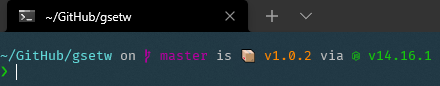
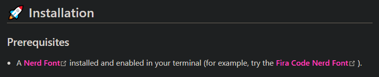
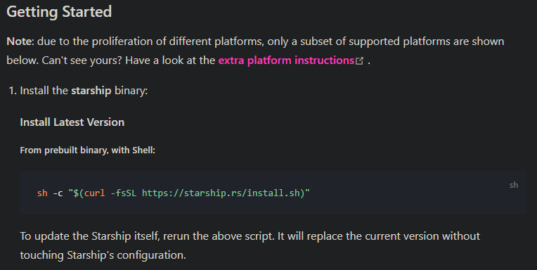
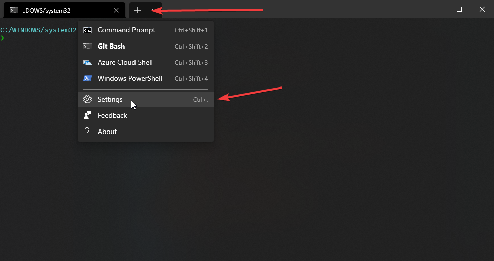
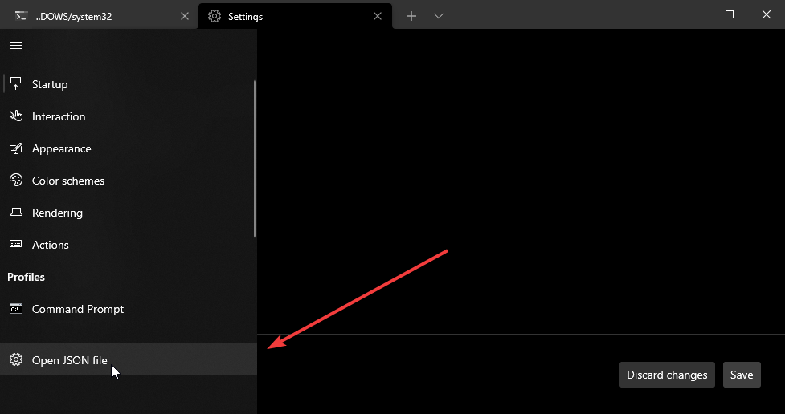
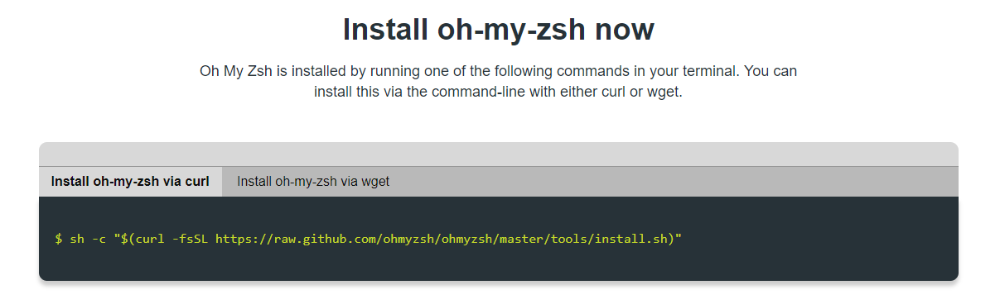

# Windows Terminal with Bash (or ZSH) and Starship

Jealous of Linux users?

Want an awesome looking CLI on Windows?

Follow this guide to get a final result like this.



## Install Windows Terminal

First of all you need a terminal capable of rendering fonts properly.

Install Windows Terminal from the [Microsoft Store](https://www.microsoft.com/en-us/p/windows-terminal/9n0dx20hk701) or from their [GitHub repository](https://github.com/Microsoft/Terminal).

## Install Git Bash

Next you need bash. I personally use Git Bash as it comes with Git preinstalled.

Install [Git](https://git-scm.com/) and make sure to include the Git Bash in the installation process.

## Install Starship

Go to [Starship's installation guide](https://starship.rs/guide/) and follow the steps for installing a font. I recommend `FiraCode Nerd Font Mono`.



Next reopen your Windows Terminal. It should open straight to Git Bash.

Run the shell command the guide gives you to install Starship, but add `-- --bin-dir ~/.config/starship` to the end of the command to install it in `C:/Users/Username/.config/starship`.



## Configure Windows Terminal

In your Windows Terminal, open up the `settings.json`.





Set `defaultProfile` to the following.

```json
"defaultProfile": "{00000000-0000-0000-0000-000000012345}",
```

Add the following profile to `profiles.list`.

Set `fontFace` to the name of the font you installed.

```json
{
	"acrylicOpacity": 0.75,
	"background": "#000000",
	"closeOnExit": true,
	"colorScheme": "GitBash",
	"commandline": "\"%PROGRAMFILES%\\git\\bin\\bash.exe\" --login -i -l",
	"cursorColor": "#FFFFFF",
	"cursorShape": "bar",
	"fontFace": "FiraCode Nerd Font Mono",
	"fontSize": 10,
	"guid": "{00000000-0000-0000-0000-000000012345}",
	"historySize": 9001,
	"icon": "%userprofile%\\.config\\terminal.ico",
	"name": "Git Bash",
	"padding": "0, 0, 0, 0",
	"snapOnInput": true,
	"useAcrylic": true
},
```

Set `schemes` to the following.

```json
"schemes": [
	{
		"name": "GitBash",
		"background": "#000000",
		"black": "#0C0C0C",
		"blue": "#6060ff",
		"brightBlack": "#767676",
		"brightBlue": "#3B78FF",
		"brightCyan": "#61D6D6",
		"brightGreen": "#16C60C",
		"brightPurple": "#B4009E",
		"brightRed": "#E74856",
		"brightWhite": "#F2F2F2",
		"brightYellow": "#F9F1A5",
		"cyan": "#3A96DD",
		"foreground": "#bfbfbf",
		"green": "#00a400",
		"purple": "#bf00bf",
		"red": "#bf0000",
		"white": "#ffffff",
		"yellow": "#bfbf00",
		"grey": "#bfbfbf"
	}
]
```

Save the file. If you get a warning or error it's alright. Just make sure the data entered doesn't get changed.

## Installing ZSH (Optional)

Go to [Oh My Zsh](https://ohmyz.sh/#install) and run the command provided.



## Adding Starship (and ZSH)

### Bash

In `C:/Users/Username/.bashrc`, add the following to the end.

```bash
eval "$(starship init bash)"
```

### ZSH

In `C:/Users/Username/.bashrc`, add the following to the end.

```bash
if [ -t 1 ]; then
exec zsh
fi
```

In `C:/Users/Username/.zshrc`, add the following to the end.

```zsh
source <(starship init zsh --print-full-init | dos2unix)
```

If https://github.com/starship/starship/issues/2449 has been fixed by the time you're reading this, add this instead.

```zsh
eval "$(starship init zsh)"
```

## Final Touches

Download the [Windows Terminal icon](https://raw.githubusercontent.com/microsoft/terminal/master/res/terminal.ico) and place it in `C:/Users/Username/.config` named `terminal.ico`.

---

Configure Starship with `C:/Users/Username/.config/starship.toml`.

---

Install the `zsh-autosuggestions` plugin (and the `git` plugin if you don't have it) and add it to your `.zshrc`.

```zsh
plugins=(git zsh-autosuggestions)
```

---

Configure your VSCode to run Git Bash, use the font you installed, and use UTF-8 encoding.
